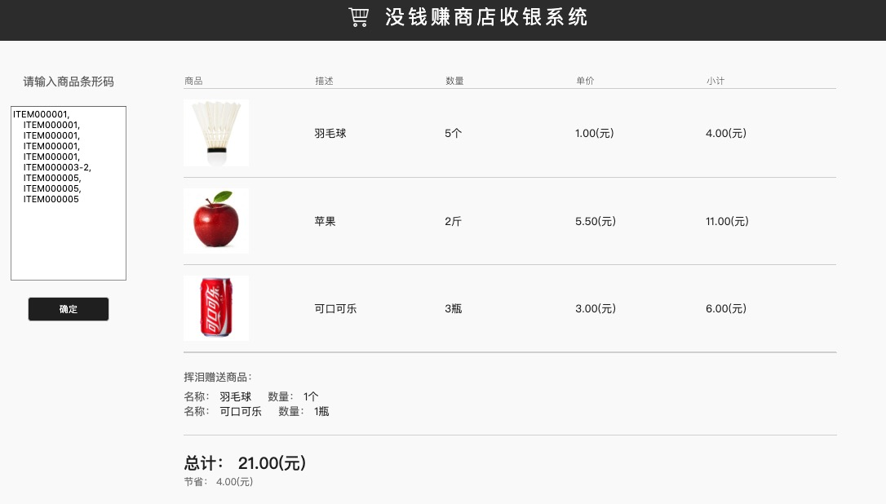

## 需求描述

商店里进行购物结算时会使用收银机（POS）系统，这台收银机会在结算时根据客户的购物车（Cart）中的商品（Item）和商店正在进行的优惠活动（Promotion）进行结算和打印购物清单。

已知该商店正在对部分商品进行“买二赠一”的优惠活动。

我们需要实现一个名为```generateOutputs```函数，该函数能够接收收银页面上输入的一系列条码，然后在浏览器中展示出结算清单。

测试输入数据：

```
    ITEM000001,
    ITEM000001,
    ITEM000001,
    ITEM000001,
    ITEM000001,
    ITEM000003-2,
    ITEM000005,
    ITEM000005,
    ITEM000005
```

其中对'ITEM000003-2'来说,"-"之前的是标准的条形码,"-"之后的是数量。
当我们购买需要称量的物品的时候,由称量的机器生成此类条形码,收银机负责识别生成小票。


输出结果如下图所示：



## 作业要求

1. 根据```spec/main-spec.js```中的测试用例，在```src/cart.js```文件中编写实现代码并确保测试通过；
2. 在浏览器打开```spec/SpecRunner.html```可查看测试运行结果;
3. 在浏览器打开```index.html```可打开收银页面，输入测试数据并验证结果；
    

## 作业提示

1. 可使用```loadAllItems()```方法获取全部的商品，该方法返回结果为一个包含了商品对象的数组（样例）：

   ```
   [ item1, item2, item3, ..., itemN ]
   ```

2. 每一个商品对象的结构如下（样例）：

   ```javascript
   {
      barcode: 'ITEM000000',
      name: '可口可乐',
      unit: '瓶',
      price: 3.00
   }
   ```

3. 可使用```loadPromotions()```方法获取全部的促销信息，该方法返回结果为一个包含有促销信息对象的数组（样例）：

   ```javascript
   [
      {
        type: 'BUY_TWO_GET_ONE_FREE',
        barcodes: [
          'ITEM000000',
          'ITEM000001'
        ]
      },
      {
        type: 'OTHER_PROMOTION',
        barcodes: [
          'ITEM000003',
          'ITEM000004'
        ]
      }
   ]
   ```
